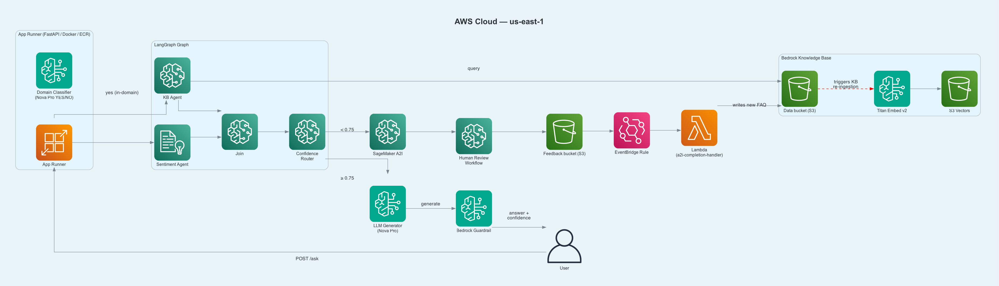

# Multi-Agent Customer Support — LangGraph on AWS

A production-ready multi-agent pipeline that answers customer support questions using LangGraph, Amazon Bedrock, Amazon Comprehend, and SageMaker A2I.

Built as a hands-on workshop lab demonstrating real-world multi-agent architecture on AWS.



## Architecture

```
POST /ask → Domain Classifier (api.py) → LangGraph Graph
                                              ├── KB Agent (Bedrock Knowledge Base)
                                              ├── Sentiment Agent (Amazon Comprehend)
                                              └── Join → Confidence Router
                                                              ├── ≥ 0.75 → LLM Generator (Nova Pro + Guardrail v4)
                                                              └── < 0.75  → Human Escalation (SageMaker A2I)
```

**Key design decisions:**
- **Domain restriction** is enforced in `api.py` via a lightweight boto3 `converse()` YES/NO classifier (not a Bedrock DENY topic, which blocks in-domain questions)
- **Bedrock Guardrail v4** (`40rxiyd6epgz`) — content filters all HIGH + contextual grounding 0.75 threshold
- **LLM is skipped entirely** when the KB has no relevant answer (prevents hallucination)
- **Self-improving loop** — A2I human answers are written back to the KB and re-indexed automatically via EventBridge + Lambda

## Project Structure

```
my-lab/
├── app/
│   ├── api.py                    # FastAPI wrapper + domain classifier
│   └── main.py                   # LangGraph graph (6 agents)
├── data/
│   └── faqs/                     # 15 Leumi Trade FAQ source files
├── infra/
│   ├── cloudformation.yaml       # S3 buckets, IAM roles, ECR, EventBridge, Lambda
│   └── a2i_worker_template.xml   # SageMaker A2I reviewer UI template
├── lambda/
│   └── a2i_completion_handler.py # Feedback loop: A2I → KB re-ingestion
├── scripts/
│   ├── deploy.sh                 # Fully automated 9-step deployment
│   └── destroy.sh                # Full teardown
├── tests/
│   ├── test_feedback_loop.py     # End-to-end feedback loop test
│   └── test_guardrails.py        # Guardrail validation tests
├── docs/
│   ├── DEPLOYMENT.md             # Detailed deployment guide
│   ├── TESTING.md                # Testing & validation guide
│   ├── architecture.png          # Architecture diagram
│   ├── curriculum/               # Workshop lecture notes
│   │   ├── lecture_english.md
│   │   └── lecture_hebrew.md
│   └── animations/               # Manim diagram generation scripts + rendered images
├── Dockerfile                    # python:3.12-slim, port 8080
├── requirements.txt
└── .dockerignore
```

## Quick Start

### Prerequisites

- AWS account with permissions for Bedrock, S3, IAM, ECR, App Runner, Comprehend, SageMaker
- AWS CLI configured (`aws configure` or named profile)
- Docker (for App Runner deployment)
- Python 3.12+

### Clone the repo

```bash
git clone https://github.com/kobyal/my-lab.git
cd my-lab
```

### Install dependencies

```bash
python3 -m venv .venv
source .venv/bin/activate
pip install -r requirements.txt
```

### Deploy

```bash
# Full automated deployment (CloudFormation → KB → Guardrail → Docker → ECR → App Runner)
bash scripts/deploy.sh
```

The script will print the live App Runner URL when complete.

**Note:** The only manual step is creating the SageMaker A2I Human Review Workflow in the AWS Console before running the script (see `docs/DEPLOYMENT.md`).

### Test locally (before deploying)

```bash
AWS_PROFILE=your-profile uvicorn app.api:api --port 8080
curl -s -X POST localhost:8080/ask \
  -H "Content-Type: application/json" \
  -d '{"question":"What is Leumi Trade?"}' | jq
```

### Tear down

```bash
bash scripts/destroy.sh
```

## AWS Resources Used

| Service | Purpose |
|---------|---------|
| Amazon Bedrock (Nova Pro) | LLM response generation |
| Amazon Bedrock Knowledge Bases | FAQ retrieval (Titan Embeddings + S3 Vectors) |
| Amazon Bedrock Guardrails | Content filtering + contextual grounding |
| Amazon Comprehend | Sentiment analysis |
| SageMaker A2I | Human escalation review |
| AWS App Runner | Serverless container hosting |
| Amazon ECR | Docker image registry |
| AWS Lambda + EventBridge | A2I feedback loop automation |
| Amazon S3 | FAQ data + feedback storage |

## Region

Deployed to **eu-west-1**. Uses cross-region inference profile `eu.amazon.nova-pro-v1:0`.

## Workshop

This repo is the source for a 2-session (3h each) hands-on workshop on building multi-agent apps with LangGraph on AWS.

Lecture notes (Hebrew and English): [`docs/curriculum/`](docs/curriculum/)
